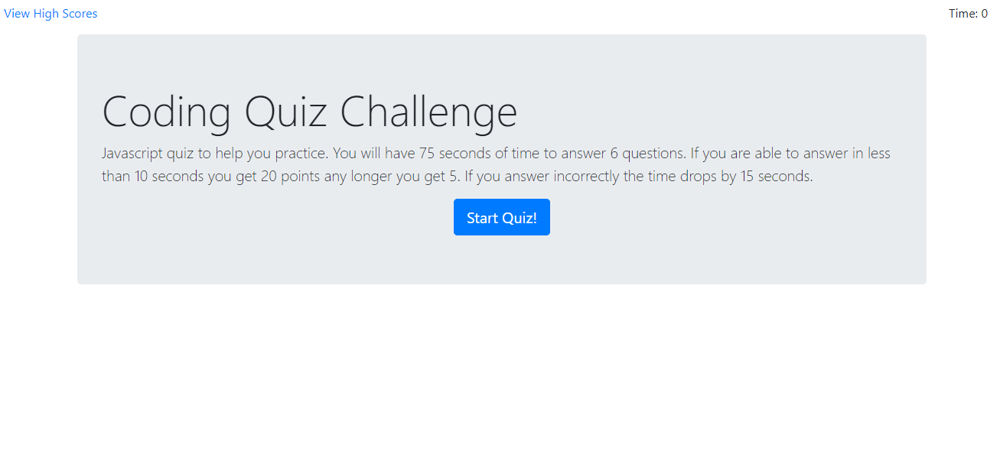

# code-quiz

Code Quiz created with JavaScript. This utilizes multiple timers to time the quiz along with timing how fast someone answers the questions. 

## Usage

If someone answers the question in 10 seconds or less they recieve 20 points otherwise they earn 5 points. The front end uses Bootstrap.  

https://wbrink.github.io/code-quiz/

